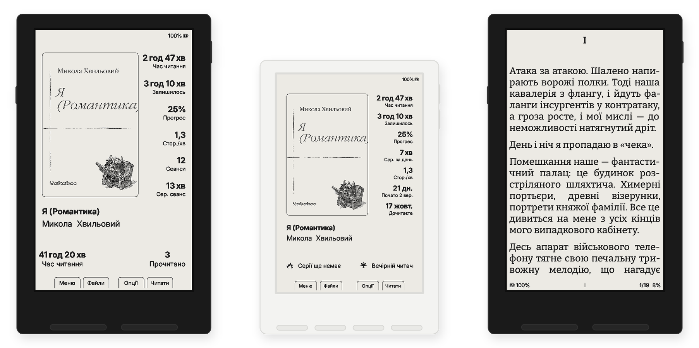
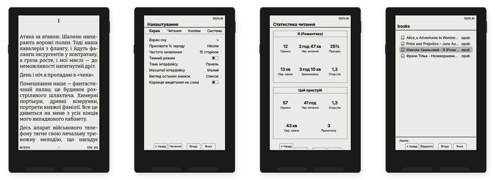
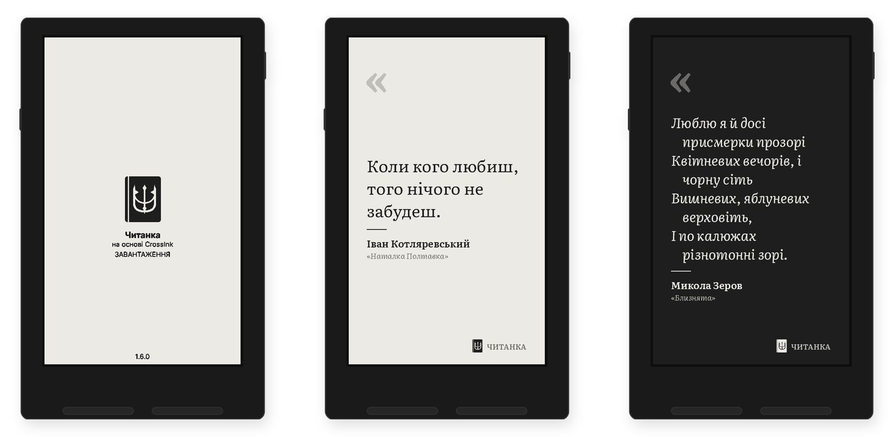
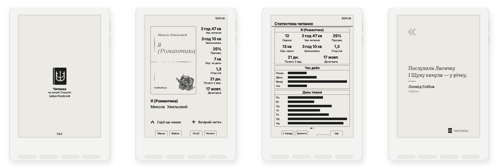
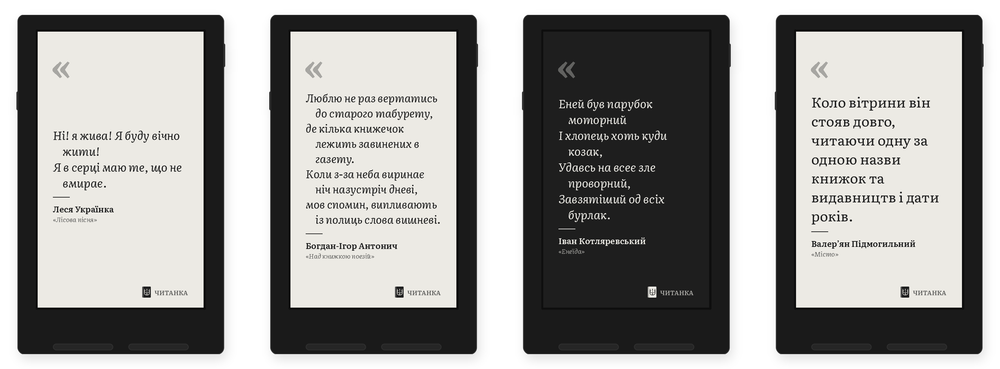
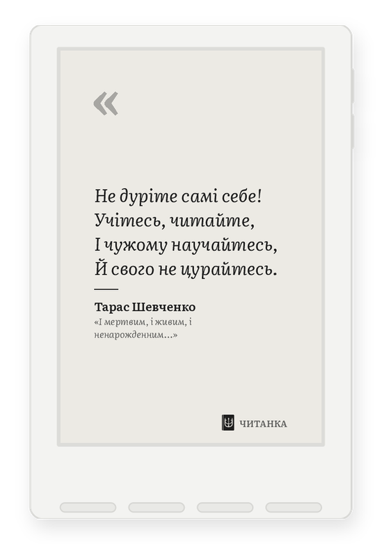
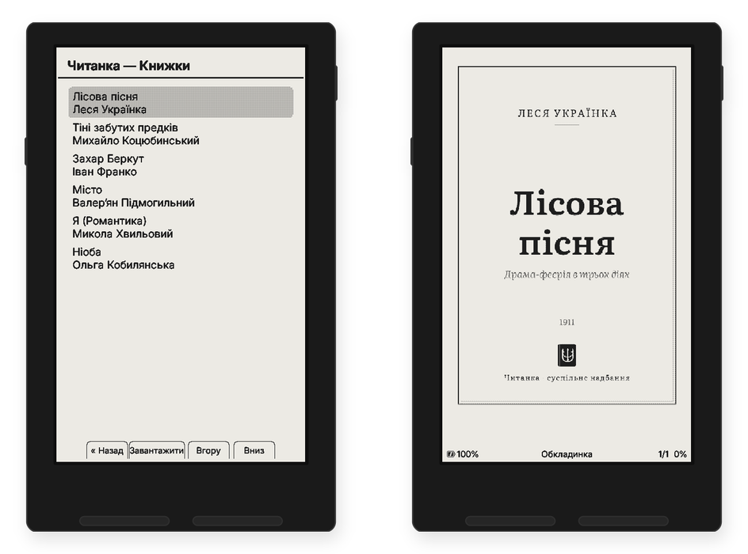

<div align="center">

<picture>
  <source media="(prefers-color-scheme: dark)" srcset="docs/chytanka/assets/logo-dark.png">
  
</picture>

# Читанка

**Українська прошивка для електронних читалок Xteink X3 і X4**<br>
на основі [CrossInk](https://github.com/uxjulia/CrossInk) · [CrossPoint](https://github.com/crosspoint-reader/crosspoint-reader)



[Що всередині](#що-всередині) · [Екрани](#екрани) · [Цитати](#цитати-на-заставці) · [Безкоштовні книжки](#безкоштовні-книжки) · [Словник](#словник) · [Шрифти](#шрифти) · [Встановлення](#встановлення) · [Збірка](#збірка-з-вихідного-коду) · [English](#english)

</div>

---

> [!NOTE]
> **Реліз [1.6.0.2](../../releases/latest)**: українська типографіка, словники, що розуміють відмінки, 16 шрифтів з повною українською абеткою та вебпортал українською. Встановлюється [з браузера в один клік](https://danylor-212.github.io/chytanka/), далі оновлюється через Wi‑Fi (OTA). Перед першою прошивкою радимо зробити бекап (див. [Встановлення](#встановлення)).

## Що всередині

Читанка — це CrossInk, доведений до ладу для українського читача. Усе, за що люблять CrossInk (панель зі статистикою читання, швидкий рушій EPUB, синхронізація з KOReader), лишається. Поверх додано:

- 🇺🇦 **Інтерфейс повністю українською.** Перекладено всі 922 рядки, без англійських «дірок». Одиниці часу (`12 год 55 хв`), десяткова кома, назви місяців. Довгі слова не вилазять за межі кнопок і колонок.
- ✂️ **Правильні українські переноси.** Виправлено переноси слів з великої літери (`Є І Ї Ґ`, зокрема в заголовках КАПСОМ) і слів з апострофом `ʼ` («обʼєднання», «під’-їзд» з дефісом за правописом).
- ❝ **Українська типографіка.** В українських книжках апостроф стає «ʼ», прямі лапки — «ялинками», дефіс між словами — тире, а однолітерні слова («в», «з», «і»…) не лишаються в кінці рядка. Читанка сама визначає українську за текстом, навіть коли в метаданих EPUB указано «ru» чи «en». Вимикається в *Налаштування → Читання → Макет сторінки*.
- 🔎 **Словник, що розуміє українську.** Слово з великої літери, з будь-яким апострофом чи наголосом, у будь-якій відмінковій формі відкривається одним дотиком. Вільні словники Вікісловника — [нижче](#словник).
- 🔤 **16 шрифтів з повною українською абеткою** у власному каталозі Читанки, завантаження прямо з читалки. Детальніше — [нижче](#шрифти).
- 📜 **Цитати української літератури на заставці.** 50 карток уже вбудовано в прошивку, повний набір зі 109 можна покласти на SD-картку. Без повторів, темний режим інвертує картку.
- 📖 **65 безкоштовних книжок української класики** в каталозі OPDS [«Читанка — Книжки»](https://danylor-212.github.io/chytanka-books/): Франко, Леся Українка, Коцюбинський, Хвильовий, Підмогильний, Котляревський та ще три десятки авторів. Завантажуються прямо з читалки через Wi‑Fi.
- 📚 **Бренд Читанки.** Логотип на екрані завантаження, назва пристрою `Chytanka X4 CrossInk`.
- 👋 **Вітальний екран.** Після переходу з CrossInk чи CrossPoint Читанка один раз пропонує перемкнути інтерфейс на українську й увімкнути рекомендовані налаштування читання. «Пізніше» нічого не змінює.
- 🌐 **Вебпортал українською.** Передавання книжок і налаштування через браузер за адресою `http://chytanka.local/` або через точку доступу «Chytanka». Під час завантаження EPUB прогресивні JPEG-обкладинки перекодовуються в браузері, тож на читалці вони не розмиваються.
- 🔄 **Власний канал оновлень.** OTA шукає релізи Читанки, тож оновлення CrossInk не перезапише українську збірку.
- ⚡ **Легша збірка.** Вшито лише дві мови інтерфейсу (українська й англійська), тож прошивка менша й лишає більше місця.

Підтримувані пристрої: **Xteink X4** і **Xteink X3** (ESP32-C3). X4 Pro, X4 Classic і Sticky поки не підтримуються.

## Екрани

<div align="center">

</div>

Зліва направо: сторінка книжки з українськими переносами, налаштування, статистика читання, бібліотека. Усе це справжній вивід прошивки із симулятора CrossInk; статистика на скрінах демонстраційна.

<div align="center">

</div>

Екран завантаження з логотипом Читанки та заставка з цитатою у світлій і темній темі.

<details>
<summary><b>Xteink X3</b>: ті самі екрани на меншому пристрої</summary>
<br>
<div align="center">

</div>
</details>

## Цитати на заставці

<div align="center">

</div>

Щоразу, коли читалка засинає, на екрані з'являється нова цитата: Шевченко, Франко, Леся Українка, Коцюбинський, Стефаник, Кобилянська, Хвильовий, Антонич, Плужник, Олесь, Теліга та ще два десятки авторів.

- **50 цитат уже вбудовано в прошивку.** Кожна картка стиснута до ~6 КБ і розпаковується рядок за рядком, тож у пам'яті ніколи не лежить повне зображення. Показ іде «мішечком»: кожна картка з'являється раз за коло.
- **Повний набір зі 109 карток** можна покласти в теку `/.sleep/` на SD-картці й вибрати заставку *Власний* (*Налаштування → Екран → Заставка → Шпалери*).
- **Кожна цитата звірена дослівно** з повним текстом твору. Усі автори — у суспільному надбанні (померли до 1954 року). Перелік джерел і відхилених «інтернет-цитат» — у [`docs/chytanka/quotes.md`](docs/chytanka/quotes.md).
- **«Цитати — темна тема»** показує картку інвертованою: світлий текст на чорному, у 4 відтінках сірого.

<div align="center">

</div>

## Безкоштовні книжки

<div align="center">

</div>

**[«Читанка — Книжки»](https://danylor-212.github.io/chytanka-books/)** — відкритий каталог української класики в суспільному надбанні: **65 книжок** прози, поезії, драми, дитячої літератури та спогадів. «Енеїда», «Лісова пісня», «Тіні забутих предків», «Захар Беркут», «Чорна рада», «Місто», «Сині етюди», «Камена», «Мартин Боруля» та інші.

- **Прямо з читалки.** Каталог працює за стандартом OPDS: *Головна → Меню → Каталог OPDS → «Читанка — Книжки»*, вибираєте книжку, і вона завантажується по Wi‑Fi в бібліотеку. Починаючи з версії 1.6.0.1 каталог уже вбудований у прошивку.
- **Адреса OPDS:** `https://danylor-212.github.io/chytanka-books/opds/index.xml` — підходить і для інших читалок та застосунків з OPDS (KOReader, PocketBook, Moon+ Reader, Thorium).
- **Якісні EPUB.** Тексти — з вичитаних за сканами видань на [uk.wikisource.org](https://uk.wikisource.org), здебільшого 1920‑х років, з правописом, близьким до сучасного. Кожна книжка має обкладинку в стилі Читанки, сторінку «Про це видання» з джерелом і проходить перевірку [EPUBCheck](https://github.com/w3c/epubcheck).
- **Легкі файли.** Зайві вбудовані шрифти вирізано: книжки важать 40 КБ – 1 МБ замість 4–5 МБ.
- **Чесно щодо прав.** Усі автори померли до 1954 року. Редакторські примітки й ілюстрації, права на які не підтверджені, прибрано; шар Вікіджерел — за CC BY-SA 4.0.
- **Оновлюється сам.** Каталог перебудовується щотижня з Вікіджерел, тож виправлення волонтерів підтягуються автоматично. Код і список книжок — у [danylor-212/chytanka-books](https://github.com/danylor-212/chytanka-books); пропозиції нових творів вітаються.

## Словник

Торкніться слова в книжці, і читалка покаже статтю зі словника на SD-картці (формат StarDict). Для Читанки є вільні словники з Вікісловника: **[danylor-212/chytanka-dicts](https://github.com/danylor-212/chytanka-dicts)**.

| Словник | Що всередині | Покриття на 1.6.0.2 |
| --- | --- | ---: |
| «Вікісловник укр-англ» | 28,8 тис. українських слів з англійськими значеннями, 302 тис. словоформ | **84,5 %** слів у 40 книжках «Читанка — Книжки» |
| «Вікісловник англ-укр» | 25,7 тис. англійських слів з українськими перекладами, без русизмів | **84,0 %** слів у 5 англійських романах |

Покриття — частка слів у текстах, для яких словник відкриває статтю. Решта — здебільшого застарілі й діалектні слова класики та власні назви.

**Встановлення:**

1. Завантажте zip зі [сторінки релізів словників](https://github.com/danylor-212/chytanka-dicts/releases/latest).
2. Розпакуйте в теку `/.dictionaries/` у корені SD-картки, щоб вийшло `/.dictionaries/Вікісловник укр-англ/uk-en.idx` (без зайвої вкладеної теки).
3. На читалці: *Налаштування → Читання → Словник* → **«Вікісловник укр-англ»**. Якщо словник не вибрано, читалка бере першу теку за абеткою, тобто «англ-укр».

З 1.6.0.2 пошук враховує велику літеру в кирилиці, будь-який апостроф (’ ' ʼ ‘) і наголоси, а відмінкові форми («книжки» → «книжка») відкриваються одразу, без питання про альтернативні форми.

Дані: [Вікісловник](https://en.wiktionary.org) через [kaikki.org](https://kaikki.org), ліцензія **CC BY-SA 4.0**. Авторство — в [ATTRIBUTION.md](https://github.com/danylor-212/chytanka-dicts/blob/main/ATTRIBUTION.md) репозиторію словників.

## Шрифти

Крім вбудованого Bitter, Читанка має власний каталог SD-шрифтів: **16 гарнітур під ліцензією SIL OFL, кожна з повною українською абеткою** (Ґ Є І Ї, апостроф, «лапки»): Alegreya, Arsenal, Bitter, ChareInk, Cormorant Garamond, Domitian, EB Garamond, Fira Sans, Inter, Literata, Noto Sans, Noto Serif, Roboto Serif, Spectral, Tinos, Vollkorn.

- **Прямо з читалки:** *Налаштування → Читання → Параметри шрифту → Завантажити шрифти* (потрібен Wi‑Fi). Шрифт ляже на SD-картку й з'явиться у виборі шрифтів.
- Шрифти без кирилиці в Читанці приховано.
- Каталог і скрипти збирання: [danylor-212/chytanka-fonts](https://github.com/danylor-212/chytanka-fonts).

## Встановлення

Підходить для **Xteink X4** і **Xteink X3** (одна прошивка для обох). X4 Pro, X4 Classic та інші читалки не підтримуються.

> [!TIP]
> Перш ніж прошивати через USB, зробіть бекап (див. [нижче](#бекап-і-відкат)). Браузерний інсталятор сам бекап не робить.

### 1. З браузера (рекомендовано)

**[danylor-212.github.io/chytanka](https://danylor-212.github.io/chytanka/)**: Chrome, Edge або Opera на комп'ютері й USB-кабель з передаванням даних.

1. Увімкніть читалку й залиште її на головному екрані, потім підключіть кабелем.
2. Натисніть **«Встановити Читанку»** і виберіть порт **«USB JTAG/serial debug unit»** (VID `303a`).
3. У вікні «Erase device» **не ставте галочку**, тоді налаштування, статистика й Wi‑Fi збережуться.
4. Після завершення, якщо читалка не перезапустилася сама: від'єднайте й під'єднайте кабель, натисніть Reset і затисніть кнопку живлення на 3–5 секунд.

Інсталятор записує завантажувач, таблицю розділів, `boot_app0` і саму прошивку. Розділи з налаштуваннями (NVS) і даними він не чіпає. Якщо порт не з'являється, на сторінці інсталятора є покрокова допомога, зокрема для читалок із заблокованим USB.

### 2. По повітрю (OTA)

Якщо Читанка вже стоїть: *Налаштування → Система → Перевірити оновлення*. Оновлення беруться тільки з [релізів Читанки](../../releases), тож стоковий CrossInk її не замінить.

Без комп'ютера й Wi‑Fi: покладіть `firmware-x3-x4.bin` з [релізу](../../releases/latest) на SD-картку й виберіть *Налаштування → Система → Оновлення прошивки з SD-картки*. Цей пункт є і в CrossInk (*Settings → System → SD Card Firmware Update*), тож так можна перейти з CrossInk на Читанку.

### 3. Вручну в браузері (esptool-js)

Завантажте чотири файли з [релізу](../../releases/latest), відкрийте [esptool-js](https://espressif.github.io/esptool-js/), натисніть *Connect* і додайте файли з такими адресами:

| Адреса | Файл |
| --- | --- |
| `0x0` | `bootloader.bin` |
| `0x8000` | `partitions.bin` |
| `0xe000` | `boot_app0.bin` |
| `0x10000` | `firmware-x3-x4.bin` |

Потім натисніть *Program*. Кнопку *Erase Flash* **не натискайте**, бо вона зітре налаштування.

### 4. З термінала (esptool)

```bash
pipx install esptool
esptool --chip esp32c3 --port /dev/ttyACM0 --baud 921600 write-flash \
  0x0 bootloader.bin 0x8000 partitions.bin 0xe000 boot_app0.bin 0x10000 firmware-x3-x4.bin
```

Порт у Windows — `COM3`, `COM4`…, у macOS — `/dev/cu.usbmodem…`. У Linux додайте себе до групи `dialout`. Контрольні суми — у `SHA256SUMS` з релізу. Для тих, хто збирає самі: `pio run -e ua -t upload`.

### Бекап і відкат

Повний бекап пам'яті (≈2 хвилини, пристрій підключений і ввімкнений):

```bash
esptool --chip esp32c3 --port /dev/ttyACM0 --baud 921600 read-flash 0 ALL x4-backup.bin
```

У бекапі є збережені паролі Wi‑Fi, тож не публікуйте його.

- **Відкат з бекапу:** `esptool --chip esp32c3 --port /dev/ttyACM0 --baud 921600 write-flash 0 x4-backup.bin`
- **Повернутися на CrossInk:** прошийте його з [inky.crossink.dev](https://inky.crossink.dev/#flash-tools).

### Після встановлення

- **Мова.** На новому пристрої інтерфейс одразу український. Якщо раніше стояв CrossInk або CrossPoint, лишається збережена мова, а вітальний екран один раз запропонує перемкнутися. Вручну: *Settings → System → Device → Language → Українська*.
- **Згладжування тексту.** Для нових налаштувань воно вимкнене: так текст чіткіший, а сторінка оновлюється один раз. Зі старими налаштуваннями вимкніть вручну: *Налаштування → Читання → Параметри шрифту → Згладжування тексту*.
- **Перехід з CrossInk:** налаштування, статистика читання й бібліотека зберігаються. Обкладинки один раз перегенеруються, а книжки під час першого відкриття заново розіб'ються на сторінки.
- **Цитати на SD (за бажанням).** Скопіюйте картки в `/.sleep/` і виберіть режим заставки *Custom*.

## Збірка з вихідного коду

Потрібен [PlatformIO Core від pioarduino](https://github.com/pioarduino/platformio-core) **v6.1.19**, як у CI. Шлях до проєкту має бути без пробілів (цього вимагає ESP-IDF).

```bash
git clone --recursive https://github.com/danylor-212/chytanka.git
cd chytanka
pio run -e ua                 # Читанка для X3/X4
pio run -e ua -t upload       # прошити підключений пристрій
```

Правила оновлення від CrossInk і випуску релізів описано в [`docs/chytanka/RELEASING.md`](docs/chytanka/RELEASING.md).

## Подяки

- **[CrossInk](https://github.com/uxjulia/CrossInk)** від Julia Nguyen: основа прошивки, панель і статистика читання. Оригінальний README — у [`docs/chytanka/CROSSINK_README.md`](docs/chytanka/CROSSINK_README.md).
- **[CrossPoint Reader](https://github.com/crosspoint-reader/crosspoint-reader)**: рушій читалки, від якого походить CrossInk. Виправлення українських переносів готуємо як внесок у CrossPoint, щоб їх отримали всі.
- Шрифт карток **[Literata](https://github.com/googlefonts/literata)** (SIL Open Font License).
- Тексти цитат: [uk.wikisource.org](https://uk.wikisource.org), [ukrlib.com.ua](https://www.ukrlib.com.ua), академічне ПЗТ Шевченка ([litopys.org.ua](http://litopys.org.ua)).

Ліцензія: **MIT**, як у CrossInk і CrossPoint.

---

## English

**Chytanka** («Читанка», *a reader*) is a Ukrainian edition of [CrossInk](https://github.com/uxjulia/CrossInk) firmware for the Xteink X3 and X4 e-readers. It keeps everything CrossInk does (the dashboard with reading stats, the fast EPUB engine, KOReader sync) and adds:

- **A complete Ukrainian UI.** All 922 strings are translated, with localised durations, decimal comma and dates, and layout fixes so longer words fit.
- **Correct Ukrainian hyphenation:** capital `Є І Ї Ґ` letters and the `ʼ` apostrophe (being prepared as an upstream contribution to CrossPoint).
- **Ukrainian literature on the sleep screen.** 50 compressed cards are built into the firmware, and the full set of 109 can go on the SD card. Every quote was checked word for word against its source text, and all authors are public domain.
- **65 free public-domain Ukrainian classics** in the [«Читанка — Книжки»](https://danylor-212.github.io/chytanka-books/) OPDS catalogue (`https://danylor-212.github.io/chytanka-books/opds/index.xml`), downloadable over Wi‑Fi straight from the reader and usable in any OPDS app.
- **Chytanka branding and its own OTA channel**, so a CrossInk update can't replace it.
- **Ukrainian typography** (ʼ apostrophe, «» quotes, dashes, no-break spaces after one-letter words), with Ukrainian books detected from their text.
- **Dictionary lookup that handles Ukrainian:** capitals, any apostrophe, stress marks and inflected forms in one tap, plus free Wiktionary dictionaries at [danylor-212/chytanka-dicts](https://github.com/danylor-212/chytanka-dicts). Coverage on 1.6.0.2 is 84.5 % (uk-en) and 84.0 % (en-uk).
- **16 OFL font families with full Ukrainian support**, downloadable on the device ([danylor-212/chytanka-fonts](https://github.com/danylor-212/chytanka-fonts)).
- **A one-time welcome screen** for devices coming from CrossInk/CrossPoint, and a **Ukrainian web portal** at `http://chytanka.local/`.
- **UK + EN built-in** for a smaller image.

Release 1.6.0.2 — install from the browser at https://danylor-212.github.io/chytanka/, then update over Wi‑Fi (OTA). Back up your device before the first flash. MIT licensed.
